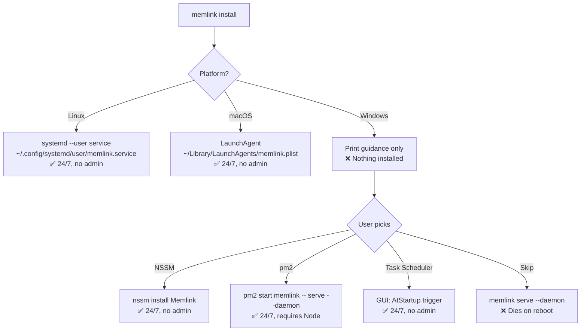

<p align="center">
  
</p>

<h1 align="center">Memlink</h1>

<p align="center">
  <strong>Universal Memory for AI Agents</strong><br/>
  Self-hosted · Fast · Organized
</p>

<p align="center">
  <a href="https://github.com/rblez/memlink/releases/latest"></a>
  <a href="https://github.com/rblez/memlink/blob/main/LICENSE"></a>
  <a href="https://www.npmjs.com/package/@memlink/cli"></a>
</p>

---

Memlink is a self-hosted MCP (Model Context Protocol) server that gives AI agents persistent, organized memory. One memory, one URL, any agent connects.

## Installation

### Standalone binary (recommended, no runtime required)

**Linux / macOS:**
```bash
curl -fsSL https://raw.githubusercontent.com/rblez/memlink/main/install.sh | bash
```

**Windows (PowerShell):**
```powershell
irm https://raw.githubusercontent.com/rblez/memlink/main/install.ps1 | iex
```

Binaries are available for `linux/amd64`, `linux/arm64`, `darwin/amd64`, `darwin/arm64`, and `windows/amd64`. See [releases](https://github.com/rblez/memlink/releases).

### npm

```bash
npm install -g @memlink/cli   # or pnpm / yarn / bun
```

Requires Node 18+ (or Bun).

### From source

```bash
git clone https://github.com/rblez/memlink.git
cd memlink
bun install
npm run build
```

## Quick Start

```bash
memlink                                # System overview
memlink add "First note" "Hello world"  # Write to default memory
memlink entries                        # List entries
memlink search "hello"                 # Search entries
memlink serve --daemon                 # Start MCP server in background
memlink url                            # Show MCP config for your agent
```

## Run as a permanent daemon (24/7)



| OS | Method | Command |
|----|--------|---------|
| **Linux** | systemd user service | `memlink install` |
| **macOS** | LaunchAgent | `memlink install` |
| **Windows** | external supervisor (NSSM/pm2/Task Scheduler) | see below |

### Linux / macOS

`memlink install` registers a system service that auto-starts on login and restarts on failure:

- **Linux**: `~/.config/systemd/user/memlink.service` (no root needed)
  - Status: `systemctl --user status memlink`
  - Logs: `journalctl --user -u memlink -f`
- **macOS**: `~/Library/LaunchAgents/memlink.plist`
  - Status: `launchctl list memlink`
  - Logs: `tail -f ~/.memlink/memlink.log`

### Windows

Windows has no native user-daemon. Pick one:

**NSSM** (recommended, no admin):
```powershell
nssm.exe install Memlink "$env:LOCALAPPDATA\memlink\memlink.exe" "serve --daemon"
nssm.exe start Memlink
```

**pm2** (requires Node):
```bash
pm2 start memlink -- serve --daemon
pm2 save
pm2 startup
```

**Task Scheduler** (GUI):
1. Open `taskschd.msc` → Create Basic Task → "Memlink"
2. Trigger: "When the computer starts"
3. Action: Start `memlink.exe` with arguments `serve --daemon`

## Commands

| Command | Description |
|---------|-------------|
| `memlink add "<title>" "<content>"` | Write entry to default memory (`--tags`, `--memory`) |
| `memlink entries` | List entries in default memory (`--memory`, `--limit`) |
| `memlink search <query>` | Search entries by title/tags (`--memory`, `--limit`) |
| `memlink url` | Show MCP config JSON for the agent |
| `memlink token [list\|revoke]` | Manage memory tokens |
| `memlink pause --memory <name>` | Suspend a memory in the daemon |
| `memlink resume --memory <name>` | Resume a paused memory |
| `memlink stop [--memory <name>]` | Stop daemon (or remove a memory) |
| `memlink serve` | Start MCP server (`--port`, `--host`, `--daemon`, `--memory`) |
| `memlink status` | Daemon + memory stats |
| `memlink install` | Install system daemon (Linux/macOS) |
| `memlink uninstall` | Remove system daemon |
| `memlink info <name\|id>` | Memory details |
| `memlink delete <name\|id>` | Permanently delete a memory |
| `memlink export [name\|id]` | Export to `.md` / `.json` / `.txt` |
| `memlink import <name\|id> <file>` | Import entries from JSON |
| `memlink config` | View or modify config (`get`, `set`) |
| `memlink skill` | Install agent skill (use `--global` for all projects) |

## Documentation

| Document | Description |
|----------|-------------|
| [Installation](/docs/installation.md) | All install methods + daemon setup |
| [Quick Start](/docs/quickstart.md) | Get running in 2 minutes |
| [CLI Reference](/docs/cli.md) | All commands and flags |
| [MCP Server](/docs/server.md) | Server config, auth, transports |
| [MCP Tools](/docs/mcp-tools.md) | All MCP tool details |
| [Agent Setup](/docs/agent-setup.md) | Connect Claude, Cursor, Windsurf, etc. |
| [Skill](/docs/skill.md) | Agent skill installation |
| [Backups](/docs/backups.md) | Backup and restore |
| [Architecture](/docs/architecture.md) | How it works |

## Environment Variables

| Variable | Description | Default |
|----------|-------------|---------|
| `MEMLINK_DIR` | Data directory | `~/.memlink` |
| `MEMLINK_PORT` / `PORT` | Server port | `4444` |
| `MEMLINK_HOST` / `HOST` | Server host | `localhost` |
| `MEMLINK_NO_REPORT` | Opt out of anonymous install reports | unset |

## MCP Tools

| Tool | Description | Params |
|------|-------------|--------|
| `memory_read` | Read index or specific entry | `id?`, `title?`, `full?`, `memory?` |
| `memory_edit` | Create or update an entry | `title`, `content`, `tags?`, `memory?` |
| `memory_search` | Search by query | `query`, `memory?`, `limit?` |
| `memory_delete` | Delete an entry | `id?`, `title?`, `memory?` |
| `memory_sync` | Memory stats | `memory?` |
| `memory_token` | List, create, or revoke tokens | `action?`, `label?`, `token?` |

Agents connect via:
```
http://localhost:4444/mcp?t=<TOKEN>      # named memory
http://localhost:4444/mcp                 # default memory
```

## Architecture

```
~/.memlink/
├── settings.json              # Global config
├── auth.json                  # Local + cloud tokens
├── default/                   # Default memory (auto-created)
│   ├── meta.json
│   ├── index.json
│   ├── 1.md, 2.md, ...        # Entries with YAML frontmatter
│   └── .backups/
├── my-project/                # Named memory
│   └── ...
```

## Robustness

- **Atomic writes**: files written to `.tmp` then renamed
- **Auto-backups**: every edit creates a backup in `.backups/`
- **File lock**: concurrent writes serialized via `.lock` with TTL + retry
- **Token routing**: in-memory `Map<token, MemoryRoute>` (no IPC)
- **Health ticker**: 30s heartbeat in `.health`
- **TTY detection**: ASCII art disabled in non-TTY (CI, Docker)

## Development

```bash
bun install              # Install deps
npm run build            # Build + typecheck
npm run dev:server       # Server with hot reload
npm run dev:cli          # CLI dev mode
npm run test             # Run tests
npm run lint             # ESLint
npm run format           # Prettier
```

## Project Structure

```
src/
├── cli/index.ts       # CLI entrypoint (commander)
├── cli/output.ts      # Output formatting, colors, branding, skill template
├── server/index.ts    # MCP server (Express + @modelcontextprotocol/sdk)
├── core/
│   ├── storage.ts     # Index+N.json CRUD, auto-backups, migration
│   ├── lock.ts        # .lock with TTL + withLock helper
│   ├── memory.ts      # Legacy CRUD, CLI helpers, config
│   └── types.ts       # Types, constants, getMemlinkDir
tests/
├── memory.test.ts     # Core memory unit tests
├── server.test.ts     # MCP server integration tests
└── unit.test.ts       # Edge cases
```

## Distribution

- **npm** — `npm install -g @memlink/cli`
- **Standalone binaries** — `install.sh` (Unix) / `install.ps1` (Windows) from GitHub Releases
- **Docker** — coming soon

## License

MIT License. See [LICENSE](LICENSE) for details.
