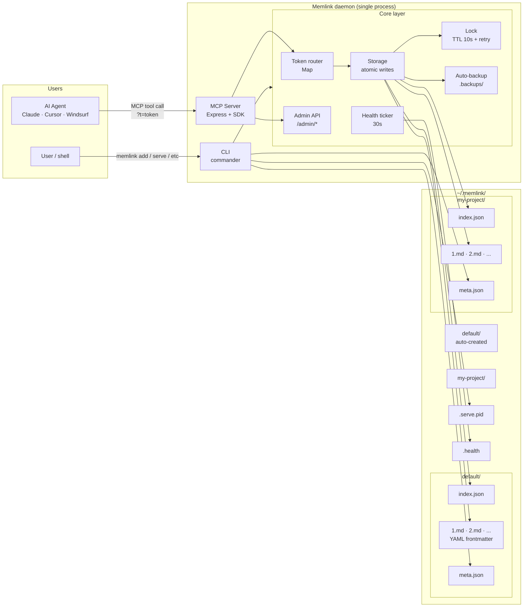

# Architecture

## System overview



## Daemon lifecycle

```mermaid
stateDiagram-v2
    [*] --> Stopped
    Stopped --> Starting: memlink serve
    Starting --> Running: PID written → .serve.pid
    Starting --> Failed: port in use
    Failed --> [*]
    Running --> Running: health tick (30s → .health)
    Running --> Running: MCP request → token lookup → tool handler
    Running --> Running: /admin/pause|resume|stop (runtime)
    Running --> Stopped: SIGINT / SIGTERM / memlink stop
    Running --> Detached: serve --daemon (Unix: detached: true; Win: VBScript WshShell.Run 0,False)
    Detached --> Running
    Stopped --> [*]
```



## Directory structure

```
~/.memlink/
├── settings.json                 # Global config (port, host, localToken, memories meta)
├── .serve.pid                    # Daemon PID (hidden)
├── .health                       # Daemon heartbeat (hidden, 30s tick)
│
├── default/                      # Default memory (auto-created, no token needed)
│   ├── meta.json                 # memoryId, token, status, createdAt, lastServedAt
│   ├── index.json                # Index: [{id, title, tags, updatedAt}, ...]
│   ├── 1.md                      # Entry 1 (YAML frontmatter + content)
│   ├── 2.md                      # Entry 2
│   └── .backups/                 # Auto-backups on every write
│       ├── 1-2026-06-07T12:00:00Z.md
│       └── ...
│
└── my-project/                   # Named memory (token required)
    ├── meta.json
    ├── index.json
    ├── 1.md
    └── .backups/

~/.agents/
└── skills/memlink/SKILL.md       # Agent skill (when installed globally)
```

## Config file

`~/.memlink/settings.json` stores global settings:

```json
{
  "version": "1.2.1",
  "baseDir": "/home/user/.memlink",
  "serverPort": 4444,
  "serverHost": "localhost",
  "auth": {
    "localToken": "..."
  }
}
```

`~/.memlink/<memory>/meta.json` stores per-memory state:

```json
{
  "memoryId": "abc123def456",
  "memoryName": "my-project",
  "token": "...",
  "status": "active",
  "createdAt": "2026-06-07T00:00:00.000Z",
  "lastServedAt": "2026-06-07T12:00:00.000Z"
}
```

## Memory storage format

### `index.json`

```json
{
  "memoryName": "my-project",
  "memoryId": "abc123def456",
  "nextId": 2,
  "entries": [
    {
      "id": 1,
      "title": "ProjectGoals",
      "tags": ["project", "goals"],
      "updatedAt": "2026-06-07T12:00:00.000Z"
    }
  ]
}
```

### `<entry-id>.md` (e.g. `1.md`)

```markdown
---
id: 1
title: ProjectGoals
tags:
  - project
  - goals
updatedAt: 2026-06-07T12:00:00.000Z
---

Build a universal memory layer for AI agents...
```

YAML frontmatter + Markdown body, plain text content (no rendering needed in storage).

## Token routing

The daemon keeps an in-memory `Map<token, MemoryRoute>`:

```typescript
type MemoryRoute = {
  name: string;       // "default" | "my-project" | ...
  dir: string;        // absolute path to ~/.memlink/<name>/
  token: string;      // registered token (or null for default)
  status: 'active' | 'paused';
  lock: Lock;         // TTL 10s
};
```

- **Default memory**: registered at startup with `token: null` (accessible without query string)
- **Named memories**: registered via `/admin/register` with their `meta.json` token
- **Paused**: `memlink pause --memory <name>` sets `status: 'paused'` → 503 on requests
- **Removed**: `memlink stop --memory <name>` deletes the route → 401 on requests

The map is wiped on daemon restart — the daemon re-registers the default memory on boot. Named memories are re-registered on first access (lazy load) by the storage layer if `meta.json` exists.

## Atomic writes

All file writes follow an atomic pattern to prevent corruption on crash:

1. Write content to `<path>.tmp`
2. `rename(<path>.tmp, <path>)` — atomic on POSIX, atomic-enough on Windows (NTFS)
3. On crash mid-write, the temp file is discarded; original data is intact

## Auto-backups

Every `createEntry` or `updateEntry` creates a timestamped backup in the memory's `.backups/` directory. No retention limit is enforced (caller can clean manually). Backup files use the same `.md` format as the live entry.

## File locking

Multi-process safety via a per-memory lock file (`<dir>/.lock`) with TTL=10s. If a writer dies mid-write, the lock auto-expires after 10s and another process can proceed.

## Daemon detachment

The `serve --daemon` flag uses different mechanisms per OS:

- **Unix**: `child_process.spawn` with `detached: true` + `child.unref()` — child becomes its own process group, parent exits immediately
- **Windows**: writes a `.vbs` wrapper that calls `WshShell.Run <path> <args>, 0, False` (`0`=hidden window, `False`=don't wait), then `child_process.spawn` runs the VBScript which exits after launching the grandchild

The grandchild detects it should run as a daemon via:
- The `--daemon-child` CLI flag, OR
- The `MEMLINK_DAEMON_CHILD` env var (legacy fallback)

The grandchild writes its own PID to `~/.memlink/.serve.pid`. On Windows, the parent no longer touches `.serve.pid` (the wscript.exe PID would be wrong).
