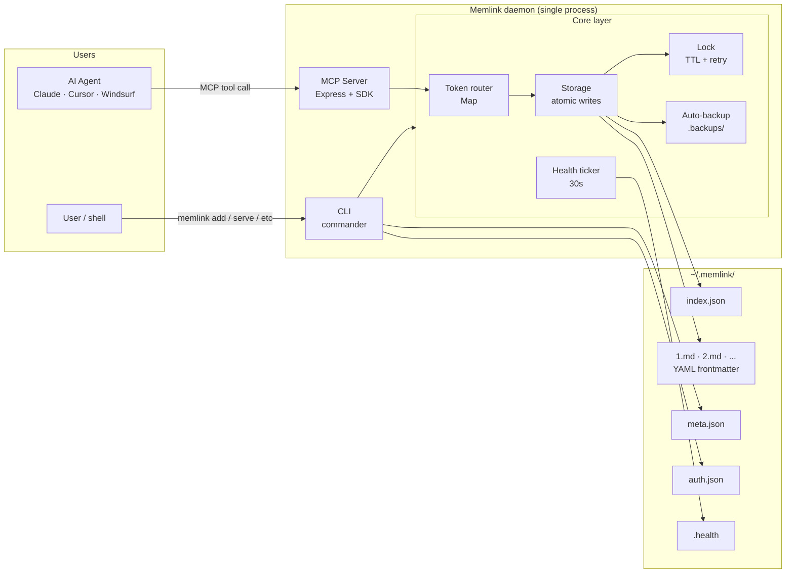
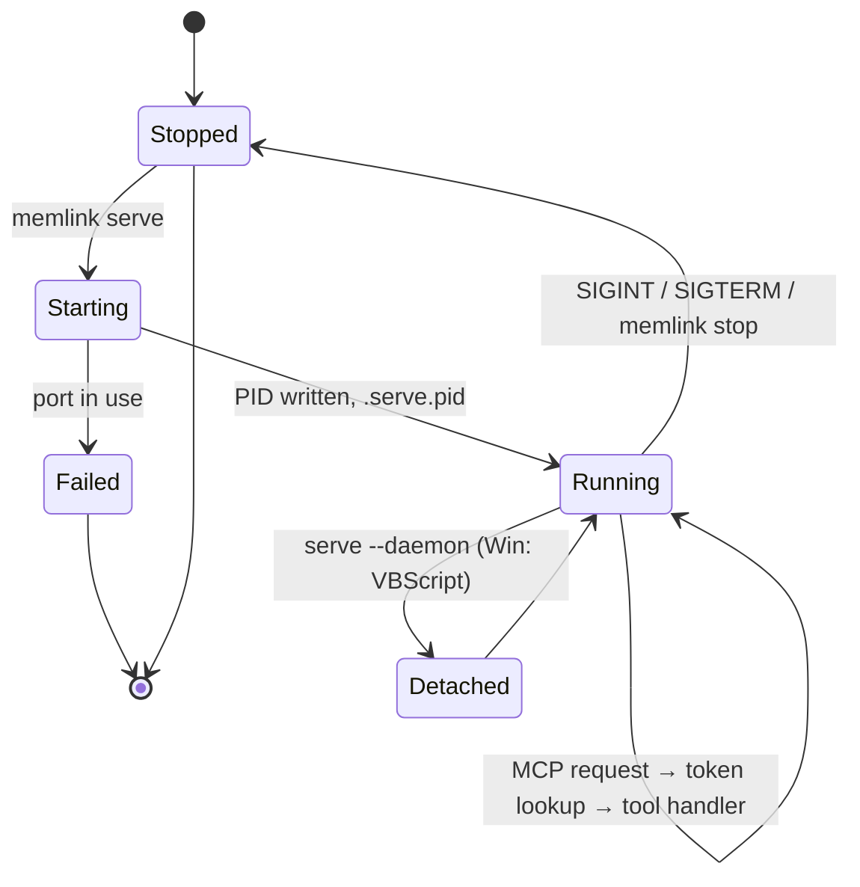

# Architecture

## System overview



## Daemon lifecycle



## Directory structure

```
~/.memlink/
├── settings.json            # Global config (memories, port, host, etc.)
├── .serve.pid               # Daemon PID (hidden)
├── exports/                 # Exported JSON flat backups
│   └── my-memory.json
│
└── <memory-name>/           # Per-memory directory
    ├── index.json           # Index (titles, tags, timestamps)
    ├── 1.json               # Entry 1 (full content)
    ├── 2.json               # Entry 2
    │
    └── .backups/            # Auto-backups on every write

~/.agents/
└── skills/memlink/SKILL.md  # Agent skill (when installed globally)
```

## Config file

`~/.memlink/settings.json` stores:

```json
{
  "version": "1.0.12",
  "baseDir": "/home/user/.memlink",
  "universalMemories": [
    {
      "memoryId": "abc123def456",
      "memoryName": "my-project",
      "createdAt": "2026-05-31T00:00:00.000Z"
    }
  ],
  "serverPort": 4444,
  "serverHost": "localhost"
}
```

## Memory storage format

Each memory is stored in a separate subfolder inside `~/.memlink/`.

### `index.json`

Stores the metadata and an index list of all entries inside the memory:

```json
{
  "memoryName": "my-project",
  "memoryId": "abc123def456",
  "nextId": 2,
  "entries": [
    {
      "id": 1,
      "title": "ProjectGoals",
      "tags": ["project", "goals"],
      "updatedAt": "2026-05-31T12:00:00.000Z"
    }
  ]
}
```

### `<entry-id>.json` (e.g. `1.json`)

Stores the complete, un-truncated content and metadata of a specific entry:

```json
{
  "id": 1,
  "title": "ProjectGoals",
  "content": "Build a universal memory layer for AI agents...",
  "tags": ["project", "goals"],
  "updatedAt": "2026-05-31T12:00:00.000Z"
}
```

## MCP transport

Memlink uses **Streamable HTTP** transport from the Model Context Protocol SDK. This is the modern, efficient transport for MCP servers, supporting:

- Long-lived connections for streaming responses
- Standard HTTP methods (POST for tools, GET for health)
- JSON-RPC 2.0 message format

Legacy SSE and Stdio transports are also available for agents that don't support Streamable HTTP.

## Authentication

Authentication is handled via the unique memory ID passed as a query parameter:

```
http://localhost:4444/mcp?id=abc123def456
```

## Atomic writes

All file writes follow an atomic pattern to prevent data corruption on crash:

1. Write content to a temporary file (`<path>.tmp`)
2. Rename/replace temp file to the target path (atomic operation on Linux/macOS)
3. On crash/error, the temp file is discarded, leaving the original data intact

## Auto-backups

Every write mutation (`createEntry` or `updateEntry`) automatically creates a timestamped backup copy of the entry inside the memory's `.backups/` directory.

## Auto-export

Export flat JSON files for backup using:

```bash
memlink export <name-or-id>
```

This writes a consolidated JSON snapshot to `~/.memlink/exports/<name>.json`.
