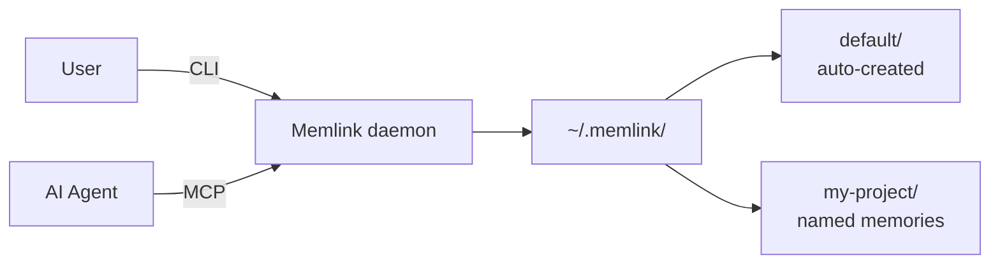

# Memlink — Universal Memory for AI Agents

Memlink is a self-hosted MCP (Model Context Protocol) server that gives AI agents persistent, organized memory. One memory, one URL, any agent connects.

## Key Features

- **Universal**: Works with any MCP-compatible agent — Claude, Cursor, Windsurf, Codex, OpenCode, Claude Code, Cline, LangChain
- **Self-hosted**: Runs locally, no cloud dependency, no data leaving your machine
- **Persistent**: Memory survives across sessions — agents pick up where they left off
- **Token routing**: Multiple memories, isolated by token in the URL
- **Atomic writes**: Files written to `.tmp` then renamed — no corruption on crash
- **Auto-backups**: Backups created automatically on every mutation
- **Searchable**: Full-text search across titles, content, and tags
- **Default memory**: Auto-created, accessible without a token
- **CLI + MCP**: Work via terminal or connect any MCP agent

## How it works

Memlink stores memories as directories in `~/.memlink/`. Each memory contains:
- `meta.json` — id, token, status
- `index.json` — list of entry titles
- `1.md`, `2.md`, ... — entries with YAML frontmatter
- `.backups/` — automatic backups on every write

Agents connect via:
- `http://localhost:4444/mcp` — default memory (no token needed)
- `http://localhost:4444/mcp?t=<token>` — named memory
