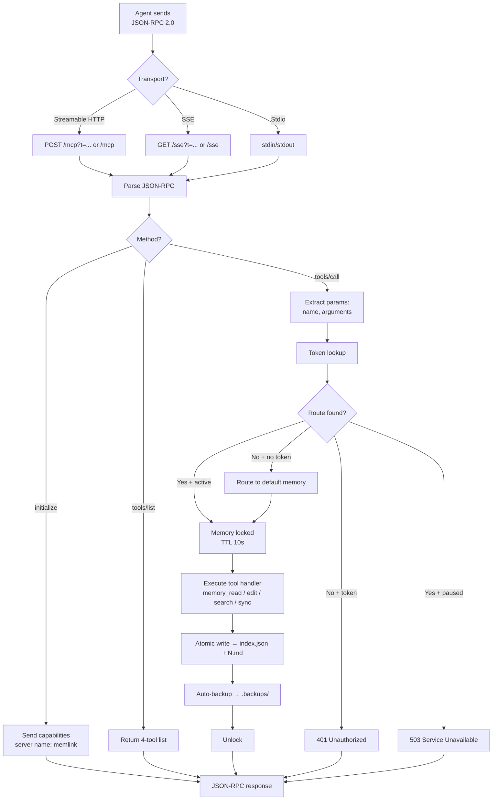
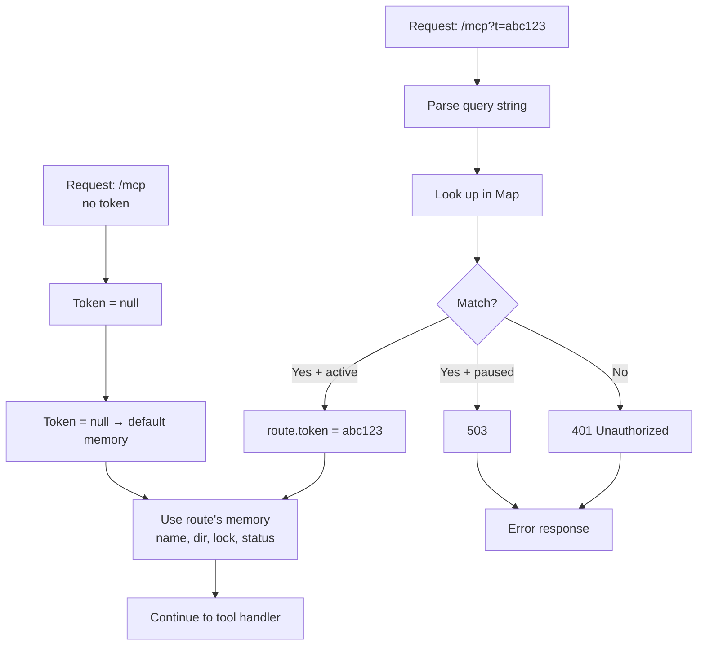

# MCP Server

## Starting the server

```bash
memlink serve --daemon
```

This starts an Express-based MCP server at `http://localhost:4444`. On startup it auto-creates the default memory (`~/.memlink/default/`) and registers it with the in-memory token router.

The server exposes:
- `GET /health` — health check
- `POST /mcp?t=<token>` — Streamable HTTP transport
- `GET /sse?t=<token>` — SSE transport (legacy)
- `POST /admin/{register,pause,resume,stop}` — admin API (local token required)

## MCP request flow



## Token routing



Token registration happens via:
- Daemon startup — auto-registers the default memory with token from `meta.json`
- `POST /admin/register` (admin API) — registers a memory with the running daemon
- `memlink pause --memory <name>` / `memlink resume` — toggles status without daemon restart

## Transports

Memlink supports three MCP transport protocols:

| Transport | URL / Config | Type |
|-----------|-------------|------|
| **Streamable HTTP** (modern) | `http://localhost:4444/mcp?t=TOKEN` | `"type": "http"` |
| **SSE** (legacy) | `http://localhost:4444/sse?t=TOKEN` | `"type": "remote"` |
| **Stdio** (subprocess) | `memlink serve --transport stdio --memory MEMORY` | `"type": "stdio"` |

Select transport with `--transport`:

```bash
memlink serve                           # Default: both HTTP transports
memlink serve --transport http          # Streamable HTTP only
memlink serve --transport sse           # SSE only
memlink serve --transport http,sse      # Both HTTP transports
memlink serve --transport stdio --memory my-memory   # Stdio (subprocess)
```

Stdio is for CLI agents that prefer launching the server as a subprocess. Requires `--memory` to specify which memory to serve (stdin/stdout only, cannot serve multiple memories).

## Custom port and host

```bash
memlink serve --port 8080 --host 0.0.0.0
```

Or via environment variables:

```bash
export MEMLINK_PORT=8080
export MEMLINK_HOST=0.0.0.0
memlink serve
```

## CORS and read-only mode

```bash
memlink serve --cors "*"              # Allow all origins
memlink serve --cors "http://app.local,https://app.com"
memlink serve --read-only             # Disable all write operations
```

## Authentication

Authentication uses the memory token in the query string:

```
http://localhost:4444/mcp?t=<token>
```

When no token is provided, requests are routed to the default memory (auto-created on first run). For optional Bearer auth, use `--bearer-token`:

```bash
memlink serve --bearer-token <secret>
# Client sends: Authorization: Bearer <secret>
```

## Health check

```
GET http://localhost:4444/health
```

Returns `200 OK` if the server is running. The daemon also writes `~/.memlink/.health` every 30 seconds; the existence and freshness of this file indicates the daemon is alive.

## Admin API

Localhost-only endpoints for runtime control (token in `~/.memlink/settings.json` → `auth.localToken`):

| Method | Path | Purpose |
|--------|------|---------|
| `POST` | `/admin/register` | Register a new memory route (body: `{name, token, status?}`) |
| `POST` | `/admin/pause` | Pause a memory (body: `{name}`) |
| `POST` | `/admin/resume` | Resume a paused memory (body: `{name}`) |
| `POST` | `/admin/stop` | Remove a memory from routing (body: `{name}`) |

The CLI wraps these:

```bash
memlink token list
memlink token revoke <token>
memlink pause --memory <name>
memlink resume --memory <name>
memlink stop --memory <name>   # remove from routing, not kill daemon
```

## Programmatic usage

```typescript
import { startServer } from '@memlink/cli/server';

await startServer(4444, 'localhost', {
  cors: '*',
  readOnly: false,
  logLevel: 'verbose',
  bearerToken: undefined,
});
```
