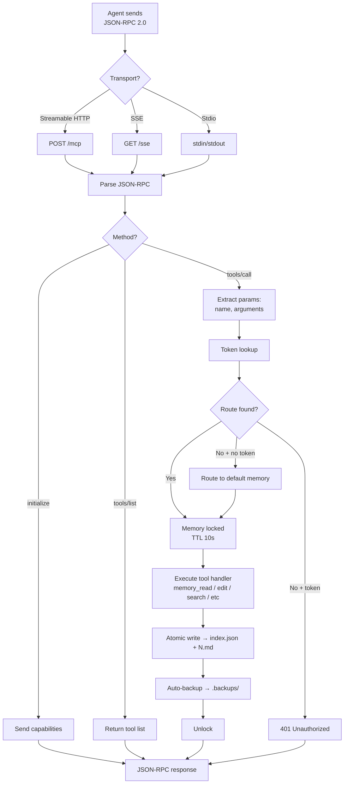
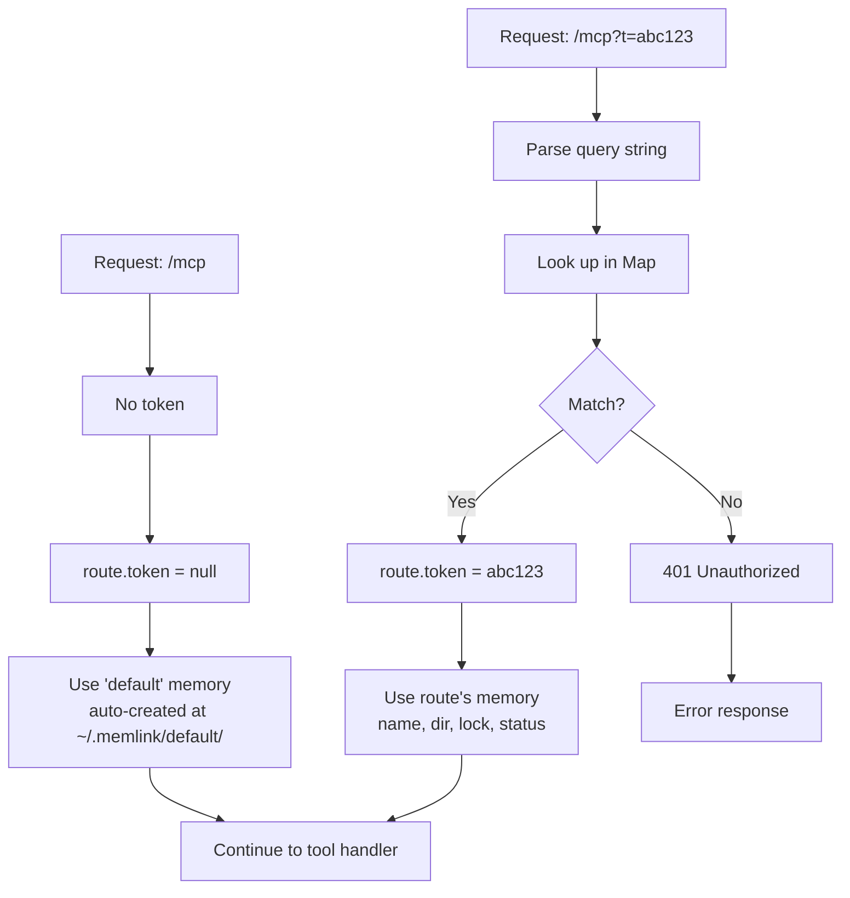

# MCP Server

## Starting the server

```bash
memlink serve
```

This starts an Express-based MCP server at `http://localhost:4444/mcp`.

## MCP request flow



## Token routing



Token registration happens via:
- `memlink token create <name>` — generates token, stores in `meta.json`
- `memlink serve --memory <name>` — registers `Map<token, route>` at startup
- `POST /admin/register` (admin API) — registers a memory with the running daemon

## Transports

Memlink supports three MCP transport protocols:

| Transport | URL / Config | Type |
|-----------|-------------|------|
| **Streamable HTTP** (modern) | `http://localhost:4444/mcp?id=MEMORY_ID` | `"type": "http"` |
| **SSE** (legacy) | `http://localhost:4444/sse?id=MEMORY_ID` | `"type": "remote"` |
| **Stdio** (subprocess) | `memlink serve --transport stdio --memory MEMORY` | `"type": "stdio"` |

Select transport with `--transport`:

```bash
memlink serve                           # Default: all HTTP transports
memlink serve --transport http          # Streamable HTTP only
memlink serve --transport sse           # SSE only
memlink serve --transport http,sse      # Both HTTP transports
memlink serve --transport stdio --memory my-memory   # Stdio (subprocess)
```

Stdio is for CLI agents that prefer launching the server as a subprocess. Requires `--memory` to specify which memory to serve (stdin/stdout only, cannot serve multiple memories).

## Custom port and host

```bash
memlink serve --port 8080 --host 0.0.0.0
```

Or via environment variables:

```bash
export MEMLINK_PORT=8080
export MEMLINK_HOST=0.0.0.0
memlink serve
```

## CORS and read-only mode

```bash
memlink serve --cors "*"              # Allow all origins
memlink serve --cors "http://app.local,https://app.com"
memlink serve --read-only             # Disable all write operations
```

## Authentication

Authentication uses the memory ID in the query string:

```
http://localhost:4444/mcp?id=abc123def456
```

Both `?id=` (preferred) and `?mem_id=` (legacy) are accepted.

## Health check

```
GET http://localhost:4444/health
```

Returns `200 OK` if the server is running.

## MCP transport

Memlink supports two MCP transport protocols:

1. **Streamable HTTP** (modern — preferred): Uses the [Streamable HTTP](https://spec.modelcontextprotocol.io/specification/2025-03-26/basic/transports/) transport from the Model Context Protocol SDK. Efficient, supports long-lived connections for streaming responses.
2. **SSE** (legacy): Uses standard Server-Sent Events for agents that don't yet support Streamable HTTP. Configured with `"type": "remote"` and `"enabled": true`.

Both transports serve the same MCP tools.

## Programmatic usage

```typescript
import { startServer } from '@memlink/cli/server';

await startServer(4444, 'localhost', { cors: '*', readOnly: false });
```
